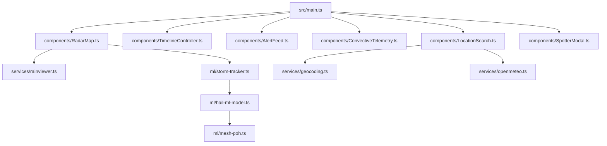

# 🗺️ Codemap di Architettura — HailCast-ML

> **Progetto:** HailCast-ML / GrandineRadar AI  
> **Versione:** 1.0.0  
> **Stack:** Vite, TypeScript, Leaflet.js, Chart.js, Python (scikit-learn)  

---

## 📌 Entry Points
- **Web App:** [`src/main.ts`](file:///c:/Users/franc/Documents/hailcast-ml/src/main.ts) — Inizializza mappe, servizi API, feed radar e controller.
- **HTML UI:** [`index.html`](file:///c:/Users/franc/Documents/hailcast-ml/index.html) — Layout principale con header glassmorphism, mappa, sidebar e timeline.
- **ML Training Pipeline:** [`ml_training/train_hail_model.py`](file:///c:/Users/franc/Documents/hailcast-ml/ml_training/train_hail_model.py) — Script di training dei modelli ML su dataset meteorologici.
- **Test Suite:** [`tests/meteorology.test.ts`](file:///c:/Users/franc/Documents/hailcast-ml/tests/meteorology.test.ts) — Test unitari Vitest per formule fisiche e cinematica.

---

## 🧩 Mappa dei Moduli & Responsabilità

### 1. Motore di Machine Learning & Fisica Meteorologica (`src/ml/`)
- [`src/ml/mesh-poh.ts`](file:///c:/Users/franc/Documents/hailcast-ml/src/ml/mesh-poh.ts):
  - Calcolo del flusso di energia cinetica $\dot{E}(Z)$ (Witt et al., 1998).
  - Funzione di peso in quota $W(H)$ basata su isoterme 0°C e -20°C.
  - Integrazione del Severe Hail Index ($SHI$).
  - Stima del diametro massimo della grandine ($MESH$).
  - Calcolo della probabilità di grandine ($POH$, Waldvogel) e severa ($POSH$).
- [`src/ml/hail-ml-model.ts`](file:///c:/Users/franc/Documents/hailcast-ml/src/ml/hail-ml-model.ts):
  - Modello di inferenza ad alberi decisionali Gradient Boosted nel browser.
  - Fusione ibrida Physics-Informed ML per la stima del diametro e della classe di rischio.
- [`src/ml/storm-tracker.ts`](file:///c:/Users/franc/Documents/hailcast-ml/src/ml/storm-tracker.ts):
  - Calcolo geodesico Haversine e Bearing angolare.
  - Generazione dei poligoni di incertezza conica (Nowcast +15m, +30m, +45m, +60m).
  - Calcolo dell'ETA d'impatto per coordinate cercate o cliccate.

### 2. Servizi Dati & API Esterne (`src/services/`)
- [`src/services/rainviewer.ts`](file:///c:/Users/franc/Documents/hailcast-ml/src/services/rainviewer.ts):
  - Connessione a RainViewer API (`weather-maps.json`) per radar Doppler mondiali e frame temporali.
- [`src/services/openmeteo.ts`](file:///c:/Users/franc/Documents/hailcast-ml/src/services/openmeteo.ts):
  - Connessione a Open-Meteo API per radiosondaggi ($CAPE$, $CIN$, Lifted Index, Zero Termico, Wind Shear).
- [`src/services/geocoding.ts`](file:///c:/Users/franc/Documents/hailcast-ml/src/services/geocoding.ts):
  - Ricerca geografica con OpenStreetMap Nominatim e cache locale per città italiane ed europee.
- [`src/services/spotter-feed.ts`](file:///c:/Users/franc/Documents/hailcast-ml/src/services/spotter-feed.ts):
  - Gestione del feed crowdsourced delle segnalazioni grandine e simulatore di supercelle convettive.

### 3. Componenti UI Interattivi (`src/components/`)
- [`src/components/RadarMap.ts`](file:///c:/Users/franc/Documents/hailcast-ml/src/components/RadarMap.ts):
  - Gestione mappa Leaflet, layer tile dark/satellite/topo, overlay radar animato, poligoni di celle e vettori.
- [`src/components/TimelineController.ts`](file:///c:/Users/franc/Documents/hailcast-ml/src/components/TimelineController.ts):
  - Player temporale con scrubber, velocità 1x/2x/4x e transizione frame passati/nowcast.
- [`src/components/AlertFeed.ts`](file:///c:/Users/franc/Documents/hailcast-ml/src/components/AlertFeed.ts):
  - Sidebar con lista celle convettive attive, badge di severità e feed degli allarmi in tempo reale.
- [`src/components/ConvectiveTelemetry.ts`](file:///c:/Users/franc/Documents/hailcast-ml/src/components/ConvectiveTelemetry.ts):
  - Drawer laterale con indici del radiosondaggio, metriche ML e grafico Chart.js del profilo verticale dBZ.
- [`src/components/LocationSearch.ts`](file:///c:/Users/franc/Documents/hailcast-ml/src/components/LocationSearch.ts):
  - Barra di ricerca con geocoding e card di rischio istantaneo per la località selezionata.
- [`src/components/SpotterModal.ts`](file:///c:/Users/franc/Documents/hailcast-ml/src/components/SpotterModal.ts):
  - Modale per la pubblicazione di segnalazioni grandine con comparatore visivo dei chicchi.

---

## 🔒 Confini & Dipendenze

