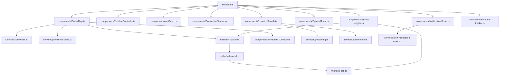

# 🗺️ Architecture Codemap — HailCast-ML

> **Project:** HailCast-ML / GrandineRadar AI  
> **Version:** 1.0.0  
> **Stack:** Vite, TypeScript, Leaflet.js, Chart.js, Python (scikit-learn)  

---

## 📌 Entry Points
- **Web App:** [`src/main.ts`](file:///c:/Users/franc/Documents/hailcast-ml/src/main.ts) — Initializes maps, API services, radar feed and controllers.
- **HTML UI:** [`index.html`](file:///c:/Users/franc/Documents/hailcast-ml/index.html) — Main layout with glassmorphism header, map, sidebar and timeline.
- **ML Training Pipeline:** [`ml_training/train_hail_model.py`](file:///c:/Users/franc/Documents/hailcast-ml/ml_training/train_hail_model.py) — ML model training script on meteorological datasets.
- **Test Suite:** [`tests/meteorology.test.ts`](file:///c:/Users/franc/Documents/hailcast-ml/tests/meteorology.test.ts) — Vitest unit tests for physical formulas and kinematics.

---

## 🧩 Module Map & Responsibilities

### 1. Machine Learning Engine & Meteorological Physics (`src/ml/`)
- [`src/ml/mesh-poh.ts`](file:///c:/Users/franc/Documents/hailcast-ml/src/ml/mesh-poh.ts):
  - Kinetic energy flux computation $\dot{E}(Z)$ (Witt et al., 1998).
  - Height weighting function $W(H)$ based on 0°C and -20°C isotherms.
  - Severe Hail Index ($SHI$) integration.
  - Maximum hail diameter estimation ($MESH$).
  - Hail probability ($POH$, Waldvogel) and severe hail probability ($POSH$) computation.
- [`src/ml/hail-ml-model.ts`](file:///c:/Users/franc/Documents/hailcast-ml/src/ml/hail-ml-model.ts):
  - In-browser Gradient Boosted decision tree inference model.
  - Hybrid Physics-Informed ML fusion for diameter and risk class estimation.
- [`src/ml/storm-tracker.ts`](file:///c:/Users/franc/Documents/hailcast-ml/src/ml/storm-tracker.ts):
  - Haversine geodesic and angular bearing computation.
  - Conical uncertainty polygon generation (Nowcast +15m, +30m, +45m, +60m).
  - Impact ETA calculation for searched or clicked coordinates.
- [`src/ml/genesis-forecast-engine.ts`](file:///c:/Users/franc/Documents/hailcast-ml/src/ml/genesis-forecast-engine.ts):
  - Multi-source cross-referencing (DPC + RainViewer + Open-Meteo + Spotters).
  - Directional vector arrows and target town corridors.
  - Quantitative hail conversion probability and dynamic storm cell maturation.

### 2. Data Services & External APIs (`src/services/`)
- [`src/services/rainviewer.ts`](file:///c:/Users/franc/Documents/hailcast-ml/src/services/rainviewer.ts):
  - RainViewer API connection (`weather-maps.json`) for global Doppler radar and time frames.
- [`src/services/protezione-civile.ts`](file:///c:/Users/franc/Documents/hailcast-ml/src/services/protezione-civile.ts):
  - DPC GeoWebCache WMTS tile service (`radar:vmi` dBZ and `radar:sri` mm/h).
  - National Radar Network (24 radar stations with coverage rings and metadata).
- [`src/services/openmeteo.ts`](file:///c:/Users/franc/Documents/hailcast-ml/src/services/openmeteo.ts):
  - Open-Meteo API connection for soundings ($CAPE$, $CIN$, Lifted Index, Freezing Level, Wind Shear).
- [`src/services/geocoding.ts`](file:///c:/Users/franc/Documents/hailcast-ml/src/services/geocoding.ts):
  - Geographic search with OpenStreetMap Nominatim and local cache for Italian and European cities.
- [`src/services/spotter-feed.ts`](file:///c:/Users/franc/Documents/hailcast-ml/src/services/spotter-feed.ts):
  - Crowdsourced hail report feed management and convective supercell simulator.
- [`src/services/alert-notification-service.ts`](file:///c:/Users/franc/Documents/hailcast-ml/src/services/alert-notification-service.ts):
  - Email alert subscriptions via FormSubmit with hail/rain thresholds and lead-time configuration.
- [`src/services/multi-source-tracker.ts`](file:///c:/Users/franc/Documents/hailcast-ml/src/services/multi-source-tracker.ts):
  - Multi-source cell lifecycle management (genesis, intensification, established, dissipation, and bivalent hail/storm mode).

### 3. Interactive UI Components (`src/components/`)
- [`src/components/RadarMap.ts`](file:///c:/Users/franc/Documents/hailcast-ml/src/components/RadarMap.ts):
  - Leaflet map management, dark/satellite/topo tile layers, animated radar overlay, DPC station networks, directional genesis vectors and cones.
- [`src/components/TimelineController.ts`](file:///c:/Users/franc/Documents/hailcast-ml/src/components/TimelineController.ts):
  - Temporal player with scrubber, 1x/2x/4x speed and past/nowcast frame transitions.
- [`src/components/AlertFeed.ts`](file:///c:/Users/franc/Documents/hailcast-ml/src/components/AlertFeed.ts):
  - Sidebar with active convective cell list, severity badges and real-time alert feed.
- [`src/components/ConvectiveTelemetry.ts`](file:///c:/Users/franc/Documents/hailcast-ml/src/components/ConvectiveTelemetry.ts):
  - Side drawer with sounding indices, ML metrics and Chart.js vertical dBZ profile chart.
- [`src/components/LocationSearch.ts`](file:///c:/Users/franc/Documents/hailcast-ml/src/components/LocationSearch.ts):
  - Search bar with geocoding and instant risk card for the selected location.
- [`src/components/SpotterModal.ts`](file:///c:/Users/franc/Documents/hailcast-ml/src/components/SpotterModal.ts):
  - Modal for publishing hail reports with visual hailstone comparators.
- [`src/components/NotificationModal.ts`](file:///c:/Users/franc/Documents/hailcast-ml/src/components/NotificationModal.ts):
  - Modal for managing email alert subscriptions (thresholds, lead time, history).
- [`src/components/WeatherFXOverlay.ts`](file:///c:/Users/franc/Documents/hailcast-ml/src/components/WeatherFXOverlay.ts):
  - Immersive canvas particle animations (bouncing hail, torrential rain, wind downburst, lightning).

---

## 🔒 Boundaries & Dependencies
